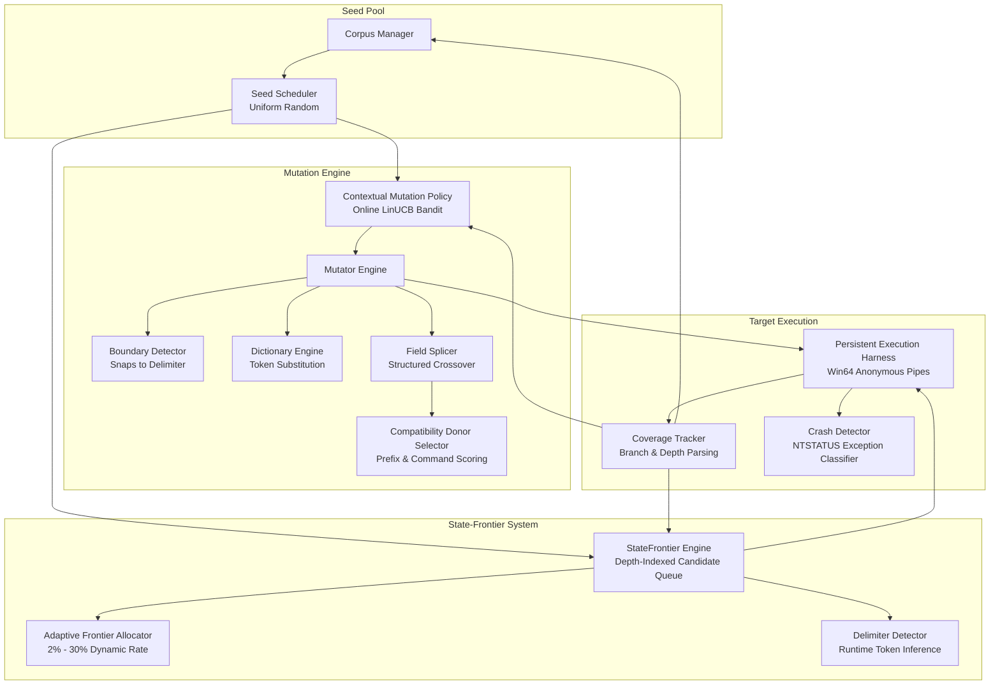

# NeuroFuzz: AI-Guided Structured Coverage-Guided Fuzzer

[]()
[]()
[]()
[]()

**NeuroFuzz** is an open-source, coverage-guided fuzzing framework specifically engineered for structured, sequential-state protocol targets. Traditional mutation-based fuzzing struggles on structured programs and multi-stage communication protocols because random byte corruption destroys structural framing, while reaching deeper program states requires preserving previously validated fields while appending valid transition tokens. NeuroFuzz introduces **StateFrontier**, an algorithm that tracks execution depth and systematically extends terminal state sequences using protocol grammar, augmented by contextual mutation bandits, compatibility-aware field splicing, runtime delimiter discovery, and a high-throughput persistent execution harness.

Across a controlled 55-trial ablation study comprising 1,375,000 executions on a multi-stage protocol benchmark, NeuroFuzz reached deep sequential protocol states (Depth 19) in 100% of trials in under 350 iterations—a threshold that unguided fuzzers failed to reach in any trial over 25,000 iterations.

---

## Core Idea

Traditional mutation-based fuzzers generate test cases through unguided point mutations:

```
Seed Corpus ──> Seed Selection ──> Random Mutation ──> Execution ──> Coverage Feedback
```

On structured targets, this process faces an exponential barrier: flipping random bytes corrupts delimiters and headers, and the probability of synthesizing multi-field state sequences decreases exponentially.

NeuroFuzz restructures the fuzzing pipeline around structural preservation and sequential state expansion:

```
Seed Corpus
     │
     ▼
Seed Selection (Random / Prioritized)
     │
     ▼
Contextual Mutation Policy (Conditions Operator on Seed Features)
     │
     ├───────────────────────────┬───────────────────────────┐
     ▼                           ▼                           ▼
Boundary-Aware Dictionary    Structured Field Splicing    Basic Byte Mutations
Mutations (snaps to '|')     (with Compatible Donors)     (bitflip, replace, etc.)
     │                           │                           │
     └───────────────────────────┼───────────────────────────┘
                                 │
                                 ▼
                    StateFrontier Extension
               (Synthesizes next sequential state)
                                 │
                                 ▼
                     Adaptive Rate Allocation
                 (Decays to 2% floor upon saturation)
                                 │
                                 ▼
                    Persistent Execution Harness
                    (Length-prefixed IPC pipes)
                                 │
                ┌────────────────┴────────────────┐
                ▼                                 ▼
         Coverage Tracker                  Crash Detector
         (Branch & Depth)             (NTSTATUS deduplication)
                │                                 │
                └────────────────┬────────────────┘
                                 │
                                 ▼
                   Corpus & StateFrontier Update
```

*Note on Architecture*: As established by our empirical ablation study, **`StateFrontier` is the primary mechanism driving deep-state discovery**. While an online `LinearBandit` seed scheduler was evaluated in earlier phases, our ablation proved that it added a 34% execution throughput penalty without improving coverage once StateFrontier was enabled; uniform random seed scheduling is therefore the verified production default.

---

## Architecture Diagram



---

## Key Contributions

### Research Contributions
1. **State-Sequence-Aware Frontier Exploration (`StateFrontier`)**: Depth-indexed candidate generation targeting terminal delimiters with grammar tokens, solving the sequential state bottleneck.
2. **Adaptive Frontier Allocation**: Dynamic exploration decay that reduces frontier candidate generation from 20% to a 2% floor after state space saturation, eliminating wasted executions.
3. **Contextual Mutation Bandits**: Online bandit conditioning operator probabilities on seed depth, command type, and delimiter density.
4. **Crash vs. Depth Tradeoff Analysis**: Formal empirical characterization showing that unguided random mutations trigger more shallow parser crashes, while syntax-preserving guided search penetrates deeper execution logic.

### Engineering Contributions
1. **Persistent Execution Harness (Win64)**: An anonymous pipe IPC harness with length-prefixed protocol and crash recovery, accelerating throughput by **11.24×** (>870 exec/s).
2. **Structured Field Splicing**: Delimiter-aware crossover supporting prefix-suffix merging, segment extraction, and single-field appending.
3. **Compatibility-Aware Donor Selection**: Multi-factor donor scoring based on shared command types and common prefix lengths.
4. **Runtime Delimiter Inference**: Automated profiling of corpus byte frequencies to infer delimiters with 100% accuracy without hardcoded target assumptions.

---

## Research Questions

- **Primary Question**: Can structured state-frontier exploration accelerate discovery of deep sequential program states that conventional mutation-based fuzzing fails to reach?
- **Secondary Questions**:
  - Does machine learning seed scheduling remain beneficial once explicit state-frontier exploration is enabled?
  - Does contextual mutation selection improve coverage breadth over static operator distributions?
  - Can protocol delimiters and boundary positions be inferred automatically at runtime without performance penalty?

---

## Controlled Empirical Results

Authoritative results from the Phase 8 ablation study (55 trials, 1,375,000 executions on `structured_target.exe`, 25,000 iterations per trial across 5 random seeds):

| Configuration | Final Coverage | Coverage AUC | Max Depth | Depth AUC | D17 Reach Rate | Mean $T_{17}$ | Unique Crashes | Throughput (exec/s) |
|---|---|---|---|---|---|---|---|---|
| **A: Random Baseline** | $61.8 \pm 1.30$ | $1,483,436 \pm 22,753$ | $14.8 \pm 1.10$ | $364,072 \pm 19,302$ | 0% | Never ($>25\text{k}$) | $188.0 \pm 124.3$ | $1,431.2 \pm 238.9$ |
| **B: NeuroFuzz (No Frontier)** | $64.8 \pm 2.05$ | $1,551,782 \pm 36,498$ | $15.2 \pm 0.84$ | $374,206 \pm 18,162$ | 0% | Never ($>25\text{k}$) | $217.2 \pm 225.5$ | $700.1 \pm 168.5$ |
| **C: NeuroFuzz Full (Fixed 20%)** | $72.0 \pm 1.58$ | $1,699,615 \pm 35,559$ | $19.0 \pm 0.00$ | $473,783 \pm 0$ | 100% | 261.0 iters | $134.4 \pm 128.8$ | $552.8 \pm 106.2$ |
| **D: NeuroFuzz Full (Adaptive)** | $72.4 \pm 3.36$ | $1,705,683 \pm 68,347$ | $19.0 \pm 0.00$ | $473,783 \pm 0$ | 100% | 261.0 iters | $130.4 \pm 83.9$ | $575.6 \pm 36.2$ |
| **E: Random + Frontier** | $72.0 \pm 0.00$ | $1,720,711 \pm 31,575$ | $19.0 \pm 0.00$ | $473,783 \pm 0$ | 100% | 261.0 iters | **291.8 ± 84.6** | $967.9 \pm 74.5$ |
| **F: Recommended Production** | **72.6 ± 1.52** | **1,758,403 ± 34,398** | $19.0 \pm 0.00$ | $473,783 \pm 0$ | 100% | 261.0 iters | $189.8 \pm 109.0$ | $876.2 \pm 67.7$ |

*For complete 11-configuration tables and paired statistical differences, see [docs/RESULTS.md](docs/RESULTS.md) and [experiments/results/phase8/PHASE8_FINAL_ANALYSIS.md](experiments/results/phase8/PHASE8_FINAL_ANALYSIS.md).*

---

## Most Important Findings

1. **StateFrontier is the decisive breakthrough**:
   - Disabling `StateFrontier` drops maximum reachable protocol depth from $19.0$ to $15.2$ ($\Delta \text{Depth} = -3.80 \pm 0.84$) and prevents discovery of deep states 17–19 ($0\%$ reach rate).
   - Adding `StateFrontier` to a pure random baseline ($E$ vs $A$) improves coverage by **$+10.20 \pm 1.30$ units** (**consistently positive across 100% of tested seeds**) and raises reachable depth from $14.8$ to $19.0$ in under 350 iterations.
2. **Online seed learning is redundant in the presence of StateFrontier**:
   - Comparing the full adaptive system ($D$) against uniform random scheduling ($F$) showed no coverage improvement ($\Delta \text{Coverage} = -0.20 \pm 4.02$).
   - Random scheduling achieved higher coverage discovery velocity ($\text{AUC } 1,758,403.4$ vs $1,705,683.1$) and eliminated a **34.3% throughput penalty** (recovering $+300.6$ exec/s).
3. **Structured Splicing & Contextual Mutation provide coverage breadth**:
   - Field splicing contributed **$+2.40 \pm 5.59$ coverage units**, preventing search entrapment.
   - Contextual mutation contributed **$+1.40 \pm 3.91$ coverage units** (positive on 4 of 5 seeds).

---

## Limitations

- **Benchmark Scope**: Evaluated on a structured multi-stage protocol binary (`targets/structured_target.c`). Findings should not be extrapolated to flat, unstructured binary file formats.
- **Statistical Power**: Sample size is $n=5$ paired seeds per configuration; while primary effects are large and strictly consistent across all seeds, secondary interaction effects carry high variance.
- **The Crash Tradeoff**: Syntax-preserving guided search reached deeper protocol states but discovered fewer total crashes than unguided random search ($130.4$ vs $291.8$), because random mutations aggressively violate parser assumptions in shallow handlers.
- **Real-World Validation**: Evaluation against mature fuzzers (AFL++, libFuzzer) on standardized real-world benchmarks (e.g., FuzzBench) remains future work.

---

## Quick Start

### 1. Requirements
- Windows 10/11 x86_64
- Python 3.10+
- MSVC (`cl.exe`) or MinGW (`gcc`) for compiling target binaries

### 2. Installation
```powershell
# Clone the repository
git clone https://github.com/user/neurofuzz.git
cd neurofuzz

# Install dependencies (Standard library + NumPy for core, Pandas/Matplotlib for analysis)
pip install -r requirements.txt
```

### 3. Run Test Suite
```powershell
# Run the complete test suite (275 tests)
python -m unittest discover -s tests -p "test_*.py"
```

### 4. Build Benchmark Target
```powershell
# Compile the structured target using MSVC
cl.exe /O2 /Fe:targets\structured_target.exe targets\structured_target.c

# Or compile using GCC
gcc -O2 -o targets/structured_target.exe targets/structured_target.c
```

### 5. Launch NeuroFuzz (Default Production Configuration)
```powershell
# Run 1,000 iterations using the recommended architecture
python -m fuzzer.fuzzer `
    --target targets/structured_target.exe `
    --corpus corpus_structured `
    --dictionary dictionaries/structured_protocol.dict `
    --dictionary-probability 0.3 `
    --iterations 1000 `
    --seed 42
```

---

## Project Documentation Index

- **[Subsystem Architecture](docs/ARCHITECTURE.md)**: Detailed breakdown of all 14 modular subsystems.
- **[Research Methodology](docs/RESEARCH_METHODOLOGY.md)**: Detailed progression across Phases 1 through 9.
- **[Empirical Results](docs/RESULTS.md)**: Authoritative numbers, paired differences, and tables.
- **[Claims & Evidence](docs/CLAIMS_AND_EVIDENCE.md)**: Audited research claim-to-evidence mappings.
- **[Experiment Index](docs/EXPERIMENTS.md)**: Catalog of Phase 7B, 7C, 7D, and Phase 8 runs.
- **[Interview Guide](docs/INTERVIEW_GUIDE.md)**: Technical pitch, architecture Q&A, and the negative ML finding story.
- **[Demonstration Walkthrough](docs/DEMO.md)**: 3–5 minute live demonstration script.
- **[Resume Bullets](docs/RESUME_BULLETS.md)**: Engineering, security, and ML resume statement variations.
- **[Portfolio Description](docs/PORTFOLIO_DESCRIPTION.md)**: Project summary for LinkedIn and portfolios.
- **[Research Paper Abstract](docs/ABSTRACT.md)**: Academic-style paper abstract.
- **[Project Contributions](docs/CONTRIBUTIONS.md)**: Research, engineering, and experimental contributions.
- **[Implementation Freeze](docs/FINAL_FREEZE.md)**: Formal declaration of code and evaluation freeze.

---

## License

This project is licensed under the MIT License. Developed for research and educational vulnerability analysis.
