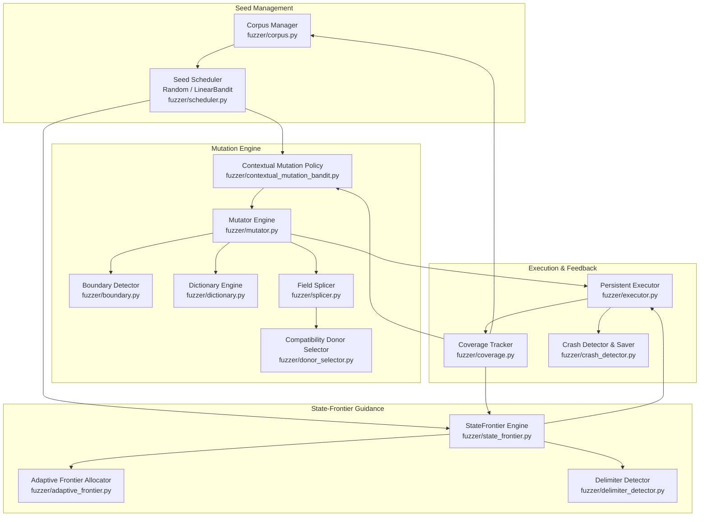

# NeuroFuzz Subsystem Architecture

**Status**: FROZEN (Phase 9 Release)  
**Target Architecture**: Windows x86_64, persistent STDIO harness  
**Python Runtime**: Python 3.10+ (Standard Library + NumPy)  

---

## Architecture Overview

NeuroFuzz is a modular, coverage-guided fuzzing framework specifically designed for structured, sequential-state protocol targets. The architecture is organized into four core layers:

---

## Subsystem Details

### 1. Corpus Management (`fuzzer/corpus.py`)
- **Responsibility**: Manages active seed test cases, tracking selection counts, discovered coverage units, and yield ratios.
- **Inputs**: Seed files from disk (`.txt`, `.bin`) or dynamically discovered inputs.
- **Outputs**: `SeedRecord` instances representing calibrated fuzzing inputs.
- **Data Structures**:
  - `SeedRecord`: Holds raw `bytes`, metadata, `coverage_units` (Set[str]), `depth`, `selection_count`, `reward_sum`, `yield_ratio`.
  - `Corpus`: Collection of `SeedRecord` objects with random access and disk export.
- **Interactions**: Feeds `SeedScheduler`, accepts new coverage inputs from `CoverageTracker`.

### 2. Coverage Tracking (`fuzzer/coverage.py`)
- **Responsibility**: Parses coverage feedback emitted by the target, maintains global execution path bitmaps, and identifies novel coverage.
- **Inputs**: Output streams from `ExecutionResult` containing `__COV__:<PATH_ID>` tokens.
- **Outputs**: Set of newly discovered coverage identifiers; boolean `is_new_coverage`.
- **Data Structures**:
  - `CoverageTracker`: Set-based coverage aggregator and frequency bitmap.
  - `extract_coverage_depth(coverage)`: Parses `DEPTH_<N>` tokens to determine maximum reached state machine depth.
- **Interactions**: Receives raw output from `Executor`, updates `Corpus`, informs `StateFrontier` and `SeedScheduler`.

### 3. Seed Scheduling (`fuzzer/scheduler.py`)
- **Responsibility**: Selects the next seed from the corpus to be mutated.
- **Implementations**:
  - `RandomScheduler` (**Default**): Selects seeds uniformly at random. Proved optimal in Phase 8 ablation when paired with `StateFrontier`.
  - `HeuristicScheduler`: $\epsilon$-greedy selection prioritizing seeds with high Laplace-smoothed yield.
  - `LinearBanditScheduler` (*Optional Experimental*): Online ridge regression ($w^T x$) over 8 seed features. Available for research exploration.
- **Interactions**: Queries `Corpus`, feeds selected `SeedRecord` to Mutation Engine.

### 4. Mutation Engine (`fuzzer/mutator.py`)
- **Responsibility**: Executes atomic byte-level and structured mutations on candidate inputs.
- **Operators**:
  - `flip_bit`: Flips a single random bit.
  - `replace_byte`: Replaces a single byte with a uniform random byte.
  - `insert_byte`: Inserts a random byte at a random index.
  - `delete_byte`: Deletes a byte at a random index.
  - `dictionary_insert_boundary`: Snaps dictionary tokens to structural boundaries (`|`).
  - `dictionary_replace`: Replaces a field token with a dictionary entry.
  - `field_splice`: Recombines fields across two compatible seeds.
- **Interactions**: Controlled by `ContextualMutationPolicy`, queries `BoundaryDetector` and `Dictionary`.

### 5. Contextual Mutation Policy (`fuzzer/contextual_mutation_bandit.py`, `fuzzer/mutation_features.py`)
- **Responsibility**: Dynamically selects mutation operators conditioned on seed context features.
- **Inputs**: 6-dimensional context feature vector (seed depth, command type, delimiter density, normalized length, prior yield, bias).
- **Outputs**: Selected operator name (`str`).
- **Algorithm**: Multi-model online linear regression with $\epsilon$-greedy exploration. Updates weights based on whether the mutation generated new coverage.
- **Interactions**: Extracts context from `SeedRecord`, directs `Mutator.mutate_with_operator`.

### 6. Boundary Detection (`fuzzer/boundary.py`)
- **Responsibility**: Identifies structural boundary indices (e.g., pipe delimiters `|`) in structured inputs to ensure mutations do not corrupt framing.
- **Inputs**: Raw byte sequences.
- **Outputs**: List of zero-based integer boundary offsets.
- **Data Structures**: `BoundaryDetector(delimiter=b'|')`.

### 7. Structured Field Splicing (`fuzzer/splicer.py`)
- **Responsibility**: Implements crossover by parsing delimited fields and recombining them between Parent A (current seed) and Parent B (donor seed).
- **Strategies**:
  - `prefix_suffix`: Merges head of Parent A with tail of Parent B.
  - `field_segment`: Extracts a field from Parent B and inserts it into Parent A.
  - `single_field_append`: Appends a donor field to Parent A.
- **Interactions**: Invokes `DonorSelector` to find compatible Parent B.

### 8. Compatibility-Aware Donor Selection (`fuzzer/donor_selector.py`)
- **Responsibility**: Scores potential donor seeds from the corpus based on protocol compatibility with the target seed.
- **Scoring Function**:
  $$S(A, B) = w_{\text{pfx}} \cdot \text{PfxLen} + w_{\text{cmd}} \cdot \mathbf{1}_{\text{cmd}} + w_{\text{proto}} \cdot \mathbf{1}_{\text{proto}} + w_{\text{extra}} \cdot \text{ExtraFields} - w_{\text{diff}} \cdot |\Delta \text{Len}|$$
- **Interactions**: Called by `FieldSplicer` during crossover mutation.

### 9. StateFrontier Engine (`fuzzer/state_frontier.py`)
- **Responsibility**: Tracks maximum protocol depth reached by each seed, maintains an active candidate queue of frontier seeds, and generates terminal boundary extensions.
- **Inputs**: Seed coverage feedback and parsed depth levels.
- **Outputs**: Candidate mutant inputs targeting the next sequential state transition.
- **Candidate Generation**: Locates the terminal delimiter of a depth-$d$ seed and appends valid grammar tokens (e.g., `|STEP=2`) derived from the dictionary.
- **Interactions**: Monitored by `AdaptiveFrontierController`, triggered by the main fuzzing loop.

### 10. Adaptive Frontier Allocator (`fuzzer/adaptive_frontier.py`)
- **Responsibility**: Dynamically regulates the probability of choosing frontier extension vs. broad fuzzing.
- **Dynamics**:
  - Nominal rate: 20%.
  - Bounded in $[2\%, 30\%]$.
  - Decays by factor of $0.85$ upon consecutive stagnant attempts.
  - Replenishes upon depth increases or new branch discoveries.
- **Interactions**: Controls `StateFrontier.get_current_rate()`.

### 11. Delimiter Detection (`fuzzer/delimiter_detector.py`)
- **Responsibility**: Infers protocol field delimiters at runtime from initial corpus seeds, eliminating hardcoded target assumptions.
- **Scoring**: Evaluates candidate ASCII delimiter bytes based on corpus presence rate, frequency regularity, field length plausibility, and prior likelihood.
- **Interactions**: Configures `BoundaryDetector`, `FieldSplicer`, and `StateFrontier`.

### 12. Persistent Execution Harness (`fuzzer/executor.py`, `fuzzer/persistent_executor.py`)
- **Responsibility**: Manages target program lifetime, executing inputs without per-execution process spawn overhead.
- **Mechanism**:
  - Spawns persistent target process once with `stdin`/`stdout`/`stderr` pipes.
  - Transmits inputs via length-prefixed protocol: `[4-byte big-endian length] + [raw input bytes]`.
  - Target processes input, emits coverage markers, and signals completion via sentinel token `__ITER_DONE__`.
  - Recovers automatically via subprocess restart if the target crashes or times out.
- **Performance**: Elevates execution rate from $\sim 70$ exec/s (subprocess) to $>870$ exec/s (persistent).

### 13. Crash Detection and Saving (`fuzzer/crash_detector.py`)
- **Responsibility**: Classifies fatal process terminations and persists reproducible crash artifacts.
- **Classification**: Distinguishes Windows NTSTATUS codes (`0xC0000005` Access Violation, `0xC00000FD` Stack Overflow, `0xC0000094` Integer Division by Zero) and POSIX signals.
- **Deduplication**: Hashes crash type and faulting path/PC offset to avoid saving redundant crashes.
- **Outputs**: Writes `.bin` (reproducing input) and `.json` (full execution metadata) to `crashes/`.

### 14. Experiment Framework (`experiments/`)
- **Responsibility**: Executes controlled, multi-trial scientific evaluations with paired random seeds, automated metric collection, and trajectory logging.
- **Outputs**: `results.csv`, `summary.json`, `trajectories/`, and publication-quality plots in `plots/`.
